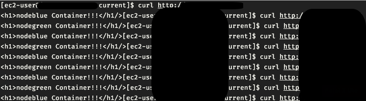

# 무중단 수동 배포 환경

---

목차

- [무중단 수동 배포 환경](#무중단-수동-배포-환경)
- [Nginx 설치](#nginx-설치)
    - [Aamazon Linux2 환경이므로 amazon linux extras로 Nginx로 설치](#aamazon-linux2-환경이므로-amazon-linux-extras로-nginx로-설치)
    - [nginx 시작](#nginx-시작)
    - [nginx 서버 access 로그 확인](#nginx-서버-access-로그-확인)
    - [Nginx 로드밸런싱 - 무중단 배포](#nginx-로드밸런싱---무중단-배포)
    - [Load Balancing Methods](#load-balancing-methods)
- [EC2에 Git 설치](#ec2에-git-설치)
    - [global config 설정](#global-config-설정)
- [Docker 설치](#docker-설치)
    - [Docker 시작](#docker-시작)
    - [Docker awslogs (cloud watch log)](#docker-awslogs-cloud-watch-log)
    - [docker run -p vs EXPOSE 차이](#docker-run--p-vs-expose-차이)
    - [cloudwatch log 비용](#cloudwatch-log-비용)
  - [Docker-Compose 설치](#docker-compose-설치)
    - [Docker-Compose.yml](#docker-composeyml)
    - [컨테이너 롤백](#컨테이너-롤백)
  - [배포/롤백 스크립트](#배포롤백-스크립트)
    - [배포 스크립트](#배포-스크립트)
    - [배포 결과](#배포-결과)
    - [롤백 스크립트](#롤백-스크립트)
    - [롤백 결과](#롤백-결과)

---

# Nginx 설치

**yum 업데이트**

```bash
sudo yum update -y
```

### Aamazon Linux2 환경이므로 amazon linux extras로 Nginx로 설치

```bash
sudo amazon-linux-extras install nginx1 -y
```

설치 후 `/etc/nginx/` 에 설치된 nginx 확인

### nginx 시작

```bash
sudo service nginx start
```

### nginx 서버 access 로그 확인

```bash
sudo tail -f /var/log/nginx/access.log
```

### Nginx 로드밸런싱 - 무중단 배포

```bash
# ./conf.d/
# /etc/nginx/conf.d/ec2-docker-upsteam.conf
upstream **docker-upstream** {
    least_conn;
    server 172.19.0.1:8002; // 도커 게이트웨이 ip
    server 172.19.0.1:8001;
    keepalive 256;
}

server {
    listen       80;
    server_name  _;

    location / {
       proxy_pass            http://**docker-upstream**;
       proxy_http_version    1.1;

       proxy_set_header    Upgrade             $http_upgrade;
       proxy_set_header    Host                $host;
       proxy_set_header    X-Real-IP           $remote_addr;
       proxy_set_header    X-Forwarded-For     $proxy_add_x_forwarded_for;
    }
}g
```

- 로드밸런서에 Docker Container Gateway IP로 등록

```bash
ls$ docker exec nodeblue route
Kernel IP routing table
Destination     Gateway         Genmask         Flags Metric Ref    Use Iface
default         ip-172-19-0-1.a 0.0.0.0         UG    0      0        0 eth0
172.19.0.0      *               255.255.0.0     U     0      0        0 eth0

$ sudo docker inspect nodeblue
{
	...
	"Networks": {
		"current_default": {
			...
			"Gateway": "172.19.0.1",
			"IPAddress": "172.19.0.2",
		}
	}
}
```

<br>

### Load Balancing Methods

**round-robin**

- 애플리케이션 서버에 대한 요청이 라운드 로빈 방식으로 분산됨

**least-connected**

- 다음 요청은 활성 연결 수가 가장 적은 서버에 할당됨

**ip-hash**

- 해시 함수는 클라이언트의 IP 주소를 기반으로 다음 요청을 위해 어떤 서버를 선택해야 하는지 결정하는 데 사용됨

**server**

- 로드밸런싱을 적용할 도커 컨테이너의 IP와 PORT
- 컨테이너 IP 조회
  - `docker inspect -f "{{ .NetworkSettings.IPAddress }}" CONTAINER_NAME`

**keepalive**

- 접속에 사용될 connection 수
- 각 worker process에서 cache 하고 있으며 최대 수에 도달하면 가장 최근에 사용된 connection이 closed 된다.

<br>

> 로드밸런싱 테스트
> 

---

# EC2에 Git 설치

```bash
sudo yum install git -y

# git 버전 확인
git version

# log alias 설정 > git hist
git config --global alias.hist "log --graph --all --pretty=format:'%C(yellow)[%ad]%C(reset) %C(green)[%h]%C(reset) | %
C(white)%s %C(italic magenta)(%cr) %C(bold red)<%an>%C(reset) %C(blue)%d%C(reset)' --date=short"
```

### global config 설정

```yaml
git config --global user.email "ooo@email.com"
git config --global user.name "ooo"

git config --global -l
```

---

# Docker 설치

```bash
sudo amazon-linux-extras install docker -y
```

### Docker 시작

```bash
sudo service docker start
```

### Docker awslogs (cloud watch log)

```bash
#EC2 인스턴스의 IAM역할에 CloudWatch log에 관한 정책추가가 필요합니다.
{
    "Version": "2012-10-17",
    "Statement": [
        {
            "Sid": "VisualEditor0",
            "Effect": "Allow",
            "Action": [
                "logs:CreateLogStream",
                "logs:PutLogEvents"
            ],
            "Resource": "*"
        }
    ]
}
```

- log driver추가한 도커 명령어 샘플

```bash
docker run -dp 3000:3000 \
	--log-driver=awslogs \
	--log-opt awslogs-region=ap-northeast-2 \
	--log-opt awslogs-group=deploytest \
	--log-opt awslogs-stream=server
	--log-opt awslogs-datetime-format='\[%Y-%m-%d %H:%M:%S\]' \
	--log-opt tag='{{.Name}}-{{.ID}}' \
	images name
```

### docker run -p vs EXPOSE 차이

- EXPOSE
  - Dockerfile로 build한 image로 띄운 컨테이너의 포트를 외부로 개방한다.
  - 하지만 사용자가 해당 포트로 접근하는것은 아니며 호스트OS로 들어오는 포트와 해당 포트를 매핑시켜야 한다.
- docker run -p 80:3000
  - 호스트OS와 컨테이너의 포트를 매핑시킨다.
  - 왼쪽이 실사용자가 접근할 포트
  - 오른쪽이 컨테이너의 포트

### cloudwatch log 비용

[Amazon CloudWatch 요금 - Amazon Web Services(AWS)](https://aws.amazon.com/ko/cloudwatch/pricing/)

| 수집(데이터 수집)        | GB당 0.76 USD                 |
| ------------------------ | ----------------------------- |
| 스토어(아카이브)         | GB당 0.0314 USD               |
| 분석(Logs Insights 쿼리) | 스캔한 데이터 GB당 0.0076 USD |

<details>
<summary>예시</summary>
<div markdown="1">

하루에 1GB의 수집된 로그 데이터를 전송하고 HTTP 응답을 모니터링하고 한 달 동안 해당 데이터를 아카이브하여 30일 기준 한 달 내내 24시간 동안 웹 애플리케이션 액세스 로그를 통해 HTTP 2xx, 3xx 및 4xx 응답 코드를 모니터링하는 경우, 요금은 다음과 같습니다.

- 월별 수집된 로그 요금총 수집된 로드 데이터 = 1GB _ 30일 = 30GB0에서 5GB = 0 USD5에서 30GB = 0.50 USD _ 25 = 12.50 USD
- 월별 모니터링 요금CloudWatch 지표 3개(지표당 0 USD) = 3 \* 0 USD = 0 USD
- 월별 아카이브된 로그 요금(로그 데이터가 6GB로 압축되었다고 가정)0에서 5GB = 0 USD5GB에서 6GB = 0.03 USD \* 1 = 0.03 USD

> **월별 CloudWatch 요금 = 12.50 USD + 0 USD + 0.03 USD = 12.53 USD**

  </div>
  </details>

## Docker-Compose 설치

```bash
# 최신 docker-compose 설치 링크
sudo curl -L "https://github.com/docker/compose/releases/download/1.29.2/docker-compose-$(uname -s)-$(uname -m)" -o /usr/local/bin/docker-compose

# 심볼릭 링크 생성
sudo ln -s /usr/local/bin/docker-compose /usr/bin/docker-compose

# 권한 변경
sudo chmod +x /usr/local/bin/docker-compose

# 설치 버전 확인
sudo docker-compose --version

```

### Docker-Compose.yml

```yaml
version: '3'

services:
  nodeblue:
    build: .
    ports:
      - '8002:3000'
    container_name: nodeblue
    logging:
      driver: awslogs
      options:
        awslogs-region: ap-northeast-2
        awslogs-group: /aws/ec2/server-dev
        awslogs-stream: apilogs
        awslogs-datetime-format: \%Y-%m-%d %H:%M:%S\]
        tag: '{{.Name}}-{{.ID}}'
    environment:
      - PORT=3000
      - CONTAINER_NAME=nodeblue
    restart: unless-stopped
```

### 컨테이너 롤백

- 배포과정에서 기존 서버는 stop 시킨 상태이기 때문에 `sudo docker ps -a` 하면 status가 Exited 되어 있습니다. 이를 롤백하기 위해서는 `docker-compose restart` 를 해야 합니다.

```bash
sudo docker-compose -f docker-compose.green.yml restart nodegreen
```

- 롤백을 한 후 떠있던 서버 종료

```bash
sudo docker-compose -f docker-compose.blue.yml stop
```

---

## 배포/롤백 스크립트

### 배포 스크립트

```sh
#!/bin/bash

cid="$(sudo docker ps -q)"

# git pull command

#first deploy
if [ -z "$cid" ]; then
  echo '\n실행중인 컨테이너 없음\n'
  echo '⬆️  ⬆️  ⬆️  ⬆️  blue server up ⬆️  ⬆️  ⬆️  ⬆️ '
  sudo docker-compose -f docker-compose.blue.yml up -d --build
  echo 'deploy done! ✅'
  sudo docker ps
else
  if sudo docker ps --format '{{.Names}}' | grep -Eq "^nodegreen\$"; then
    # if current server [green]
    echo '⬆️  ⬆️  ⬆️  ⬆️  blue server up ⬆️  ⬆️  ⬆️  ⬆️ '
    sudo docker-compose -f docker-compose.blue.yml up -d --build
    sleep 0.2

    echo '⬇️  ⬇️  ⬇️  ⬇️  green server stop ⬇️  ⬇️  ⬇️  ⬇️ '
    sudo docker-compose -f docker-compose.green.yml stop nodegreen
    echo 'deploy done! ✅'
    sudo docker ps -a
  else
    # if current server [blue]
    echo '⬆️  ⬆️  ⬆️  ⬆️  green server up ⬆️  ⬆️  ⬆️  ⬆️ '
    sudo docker-compose -f docker-compose.green.yml up -d --build
    sleep 0.2

    echo '⬇️  ⬇️  ⬇️  ⬇️  blue server stop ⬇️  ⬇️  ⬇️  ⬇️ '
    sudo docker-compose -f docker-compose.blue.yml stop nodeblue
    echo 'deploy done! ✅'
    sudo docker ps -a
  fi
fi

```

### 배포 결과

```sh
$ ./blue-green-deploy.sh

⬆️  ⬆️  ⬆️  ⬆️  blue server up ⬆️  ⬆️  ⬆️  ⬆️
WARNING: Found orphan containers (nodegreen) for this project. If you removed or renamed this service in your compose file, you can run this command with the --remove-orphans flag to clean it up.
Building nodeblue
Sending build context to Docker daemon  51.71kB
Step 1/6 : FROM node:16-alpine
 ---> 59b389513e8a
Step 2/6 : WORKDIR /usr/src/app
 ---> Using cache
 ---> 04ded3498547
Step 3/6 : COPY package.json ./
 ---> Using cache
 ---> 3f1a99bc47cc
Step 4/6 : RUN npm install --silent
 ---> Using cache
 ---> 73fea25f9753
Step 5/6 : COPY . .
 ---> Using cache
 ---> da00d7463bd3
Step 6/6 : CMD [ "node", "app.js" ]
 ---> Using cache
 ---> 6fc265853e14
Successfully built 6fc265853e14
Successfully tagged current_nodeblue:latest
Recreating nodeblue ... done
⬇️  ⬇️  ⬇️  ⬇️  green server stop ⬇️  ⬇️  ⬇️  ⬇️
Stopping nodegreen ... done
deploy done! ✅
CONTAINER ID   IMAGE               COMMAND                  CREATED              STATUS                                PORTS                                       NAMES
c1b40aaa9395   current_nodeblue    "docker-entrypoint.s…"   12 seconds ago       Up 11 seconds                         0.0.0.0:8002->3000/tcp, :::8002->3000/tcp   nodeblue
5536c9c0efb4   current_nodegreen   "docker-entrypoint.s…"   About a minute ago   Exited (137) Less than a second ago                                               nodegreen
```

### 롤백 스크립트

```sh
#!/bin/bash

cid=$(sudo docker ps -q)

if [ -n "$cid" ]; then
  if sudo docker ps --format '{{.Names}}' | grep -Eq "^nodegreen\$"; then
    # current server [green]
    # need rollback [blue]

    echo '⬆️  ⬆️  ⬆️  ⬆️  blue server restart ⬆️  ⬆️  ⬆️  ⬆️ '
    sudo docker-compose -f docker-compose.blue.yml restart nodeblue
    sleep 0.2

    echo '⬇️  ⬇️  ⬇️  ⬇️  green server stop ⬇️  ⬇️  ⬇️  ⬇️ '
    sudo docker compose -f docker-compose.green.yml stop nodegreen
    sleep 0.2

    echo 'blue rollback done! ✅'
    sudo docker ps -a
  else
    # current server [blue]
    # need rollback [green]

    echo '⬆️  ⬆️  ⬆️  ⬆️  green server restart ⬆️  ⬆️  ⬆️  ⬆️ '
    sudo docker-compose -f docker-compose.green.yml restart nodegreen
    sleep 0.2

    echo'⬇️  ⬇️  ⬇️  ⬇️  blue server stop ⬇️  ⬇️  ⬇️  ⬇️ '
    sudo docker compose -f docker-compose.blue.yml stop nodeblue
    sleep 0.2

    echo 'green rollback done! ✅'
    sudo docker ps -a
  fi
fi

```

### 롤백 결과

```sh
$ ./blue-green-rollback.sh
⬆️  ⬆️  ⬆️  ⬆️  blue server restart ⬆️  ⬆️  ⬆️  ⬆️
Restarting nodeblue ... done
⬇️  ⬇️  ⬇️  ⬇️  green server stop ⬇️  ⬇️  ⬇️  ⬇️
Stopping nodegreen ... done
blue rollback done! ✅
CONTAINER ID   IMAGE               COMMAND                  CREATED         STATUS                                PORTS                                       NAMES
c1b40aaa9395   current_nodeblue    "docker-entrypoint.s…"   6 minutes ago   Up 11 seconds                         0.0.0.0:8002->3000/tcp, :::8002->3000/tcp   nodeblue
5536c9c0efb4   current_nodegreen   "docker-entrypoint.s…"   7 minutes ago   Exited (137) Less than a second ago                                               nodegreen
```
